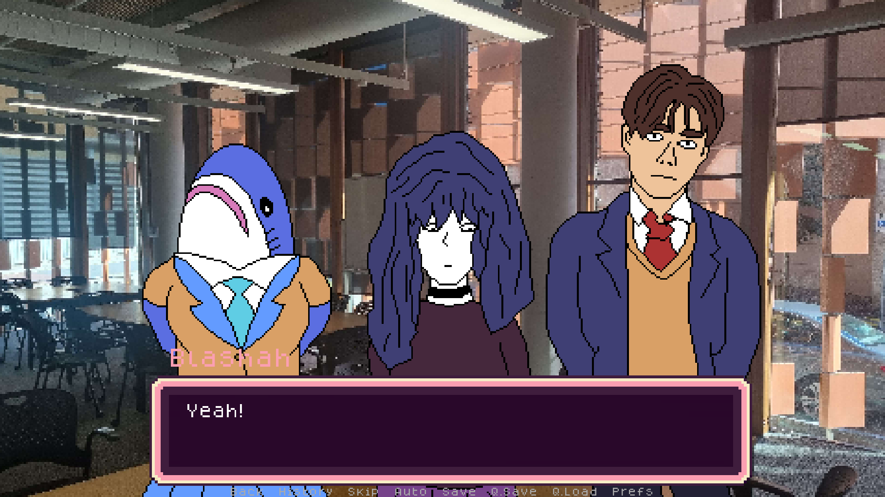

# LeetLetter, a coding challenge in dating sim form
**The only UQCS Hackathon2024 project to not use ChatGPT and AI!\***

With a newly broken heart, your curiosity gets the better of you when you join 
your high school's programming club.

Available to download at https://wumeno.itch.io/leetletter 

# Characters

**Take on the programming problems of one of the programming club's three members!**

## Blahshah
- The club's leader.
- A mysterious anime girl-like shark from another world.
- Will need you to test out her uh, coding tests.

## Sammy
- The club's flirty boy.
- Will not hesitate to talk about relationships with you.
- Needs your help on a poker game.

## Hopper
- The club's resident reclusive goth girl.
- Harbours an inside personality hidden behind multiple layers of irony.
- Wants you to code a spiral generator, for some mysterious reason.

# Technologies
https://www.renpy.org/ - Visual Novel game engine

https://www.aseprite.org/ - Pixel art editor

# Credits
Built entirely by **Team LeetLetter**

## Gareth Guce
- Project Lead
- Narrative Writer
- Renpy Scripter
- Testing Implementer

## Corran O'Shea
- Character Designer
- GUI Designer

*claim may be rescinded in the event that another Hackathon2024 project has
been found to not use AI.
